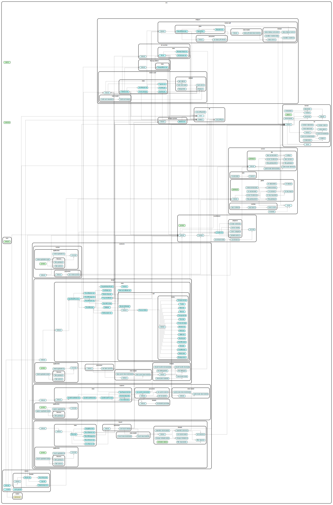

# clashboard tour: one click, end to end

This is the manga's first chapter. We follow a single user action — clicking the status pill on a card and picking a new status — through every layer of clashboard's architecture: view, presenter, view-model, coordinator, cache port, gateway, and back. By the end you should be able to open the codebase cold and know where everything lives, why each layer exists, and which dependency-law edges the action travels along.

The action is small but exercises every layer the [context map](../CONTEXT-MAP.md) names: the widget (status pill) calls a coordinator action, the coordinator orchestrates two contexts (Board + Detail) by patching their caches optimistically, the network call goes through a TanStack Start server function to a Jira HTTP gateway, and the result either commits the optimistic patch or rolls it back with a toast. Each section below names one layer, shows ~10 lines of real code, and ends with **what to notice** — the architectural invariant that excerpt makes concrete.

## 1. The click — the view

The view is the surface the user touches. It composes design-system primitives and forwards events; it never owns business logic. The pill's clickable shell lives in [`src/widgets/status-pill/view/StatusPillSelect.tsx`](../src/widgets/status-pill/view/StatusPillSelect.tsx).

```tsx
// src/widgets/status-pill/view/StatusPillSelect.tsx (excerpt)
const { display, triggerRef, toggle, selectTransition } = useStatusPillSelect(issueKey, status)

return (
  <div ref={triggerRef} className="relative inline-block" onClick={stopBubble}>
    <button
      type="button"
      onClick={(e) => { e.stopPropagation(); toggle() }}
      aria-haspopup="menu"
      aria-expanded={display.open}
      aria-label={`Change status from ${status}`}
    >
      <StatusPill status={status} />
    </button>
```

**What to notice:**

- The view holds zero knowledge of TanStack Query, Jira, transitions, or caches. It calls `toggle()` and `selectTransition()` — both functions handed to it by the presenter.
- The component file imports `useStatusPillSelect` from `../presenter` and `StatusPill` / `StatusIcon` from sibling view files. There is no path through this file to `~/server` or `~/coordinator`.
- The file lives in `widgets/`, not `contexts/`: the status pill is a reusable visual surface, not a bounded context. Both the Board cards and the Detail panel reuse it.

## 2. The presenter — the React-bound shell

The presenter is the only layer in this trace allowed to import React, TanStack Query, or DOM listeners. It owns subscription, effects, and event-handler glue; it produces no business logic of its own. See [`src/widgets/status-pill/presenter/use-status-pill-select.ts`](../src/widgets/status-pill/presenter/use-status-pill-select.ts).

```ts
const [state, dispatch] = useReducer(reduce, initialState)
const triggerRef = useRef<HTMLDivElement>(null)
const transitions = useTransitions(issueKey, state.open) // (1)
const mutation = useTransitionAction() // (2)
const display = derive(state, currentStatus, transitions)

return {
  display,
  triggerRef,
  toggle: () => dispatch({ type: 'toggle' }),
  selectTransition: (transitionId, toStatusName) => {
    dispatch({ type: 'close' })
    mutation.mutate({ key: issueKey, transitionId, toStatusName }) // (3)
  },
}
```

**What to notice:**

- `(1)` and `(2)` are the only TanStack-Query touches in the trace, and both go through coordinator hooks — never `useQuery` directly. Every layer below is framework-free.
- `display` is computed by passing the reducer state and the query result into a pure `derive(...)` call. The presenter doesn't know what `display` _means_; the view-model does.
- `(3)` is where the click leaves the widget. `selectTransition` dispatches a local `close` event and then fires the coordinator action — the seam where local React state meets cross-context workflows.

## 3. The view-model — the framework-free state machine

The view-model is plain TypeScript: a reducer plus a derivation function. No React. No TanStack Query. No DOM. It is unit-testable as ordinary functions (no `renderHook`, no fakes). See [`src/widgets/status-pill/view-model/status-pill-select-view-model.ts`](../src/widgets/status-pill/view-model/status-pill-select-view-model.ts).

```ts
// src/widgets/status-pill/view-model/status-pill-select-view-model.ts (excerpt)
import { match } from 'ts-pattern'

export type State = { open: false } | { open: true }
export const initialState: State = { open: false }

export type Event = { type: 'toggle' } | { type: 'close' }

export function reduce(state: State, event: Event): State {
  return match(event)
    .with({ type: 'toggle' }, () => ({ open: !state.open }) as State)
    .with({ type: 'close' }, () => ({ open: false }) as State)
    .exhaustive()
}
```

**What to notice:**

- The import line shows zero React, zero TanStack, zero `sonner`. The only dependency is `ts-pattern` and a kernel type (`GetTransitionsResult`, used further down in `derive`).
- `match(...).exhaustive()` is the spine. Adding a new event variant becomes a compile error here _and_ at every other call site that matches over events — exhaustiveness is the architectural gate ([ADR 0002](./adr/0002-bounded-contexts-and-layer-vocabulary.md), [ADR 0003](./adr/0003-framework-free-view-models.md)).
- Tests live next to the file and exercise `(state, event) → state'` and `(state, queryData) → DisplayState` directly — no `renderHook`, no mock boundaries.

## 4. The coordinator — cross-context orchestration

`mutation.mutate` reaches the coordinator's `applyTransition` workflow via the `useTransitionAction` hook in `src/coordinator/hooks.ts`. Inside the coordinator, we leave React behind for good. The coordinator is a framework-free factory that takes ports and orchestrates workflows that span more than one context. See [`src/coordinator/coordinator.ts`](../src/coordinator/coordinator.ts).

```ts
// src/coordinator/coordinator.ts (excerpt)
async function runApplyTransition(
  input: ApplyTransitionInput,
): Promise<Result<void, ApplyTransitionError>> {
  const { key, transitionId, toStatusName } = input

  await Promise.all([cache.cancelBoard(), cache.cancelIssue(key)])

  const rollbackBoard = cache.patchBoard((prev) => /* … patch board cache … */)
  const rollbackIssue = cache.patchIssue(key, (prev) => /* … patch issue cache … */)

  let result: TransitionIssueResult
  try {
    result = await jira.transitionIssue({ data: { key, transitionId } })
```

**What to notice:**

- The signature returns `ResultAsync<void, ApplyTransitionError>` — a `neverthrow` type whose error channel is a hand-rolled tagged union (`TransitionRejected | TransitionUnauthorized | TransitionNetworkError`). The wire format and the architecture share the same shape ([ADR 0004](./adr/0004-neverthrow-client-effect-server.md)).
- The coordinator depends on _ports_, not adapters: `cache`, `toast`, `jira.transitionIssue`. The `CoordinatorProvider` wires real adapters in at the React boundary; tests wire fakes.
- This is the only layer that touches both Board and Detail in one call (`cancelBoard` + `cancelIssue`, `patchBoard` + `patchIssue`). Cross-context choreography lives here, not in either context.

## 5. The optimistic patches — the Cache port

The coordinator does not import TanStack Query. It calls a `Cache` port whose methods are shaped per-context: `patchBoard`, `patchIssue`, `cancelBoard`, `cancelIssue`, `invalidateIssue`, `invalidateTransitions`. See [`src/coordinator/ports.ts`](../src/coordinator/ports.ts).

```ts
// src/coordinator/ports.ts (excerpt)
export type Patch<T> = (prev: T | undefined) => T | undefined
export type Rollback = () => void

export interface Cache {
  readBoard(): SearchIssuesResult | undefined
  readIssue(key: string): GetIssueResult | undefined
  // …
  patchBoard(patch: Patch<SearchIssuesResult>): Rollback
  patchIssue(key: string, patch: Patch<GetIssueResult>): Rollback
  cancelBoard(): Promise<void>
  cancelIssue(key: string): Promise<void>
  invalidateIssue(key: string): void
  invalidateTransitions(key: string): void
}
```

The TanStack Query implementation lives behind that port in [`src/coordinator/adapters/tanstack-cache.ts`](../src/coordinator/adapters/tanstack-cache.ts) — it is the _only_ file outside `presenter/` allowed to know that we use TanStack Query at all.

**What to notice:**

- The port shape is per-context (`patchBoard`, `patchIssue`) even though one adapter implements it. The coordinator gets per-context cache abstractions through method names, not through reaching into `contexts/board/application` or `contexts/detail/application`.
- `patchBoard` returns a `Rollback`. The coordinator captures both rollback closures up front, then either commits (by invalidating after the network call succeeds) or replays them on failure.
- Each context's own application service (e.g. [`board-application.ts`](../src/contexts/board/application/board-application.ts), [`detail-application.ts`](../src/contexts/detail/application/detail-application.ts)) owns its own gateway and a cache port for its _own_ load + refresh use cases. Cross-context optimistic mutation is the coordinator's job, not a single context's.

## 6. The gateway call — the network boundary

`jira.transitionIssue` is wired to a TanStack Start server function. From the client's point of view it is a normal async function returning a tagged union; under the hood, TanStack Start serialises the call across the network boundary. See [`src/server/jira/server-functions.ts`](../src/server/jira/server-functions.ts) and [`src/server/jira/http-gateway.ts`](../src/server/jira/http-gateway.ts).

```ts
// src/server/jira/server-functions.ts (excerpt)
export const transitionIssue = createServerFn({ method: 'POST' })
  .inputValidator((data: { key: string; transitionId: string }) => ({
    key: requireKey('transitionIssue', data?.key),
    transitionId: requireKey('transitionIssue (transitionId)', data?.transitionId),
  }))
  .handler(({ data }) => service().performTransition(data.key, data.transitionId))
```

```ts
// src/server/jira/http-gateway.ts (excerpt)
transitionIssue(key, transitionId) {
  return call<void>(async () => {
    await request<void>(`/rest/api/3/issue/${encodeURIComponent(key)}/transitions`, {
      method: 'POST',
      body: { transition: { id: transitionId } },
    })
  })
},
```

**What to notice:**

- `call<T>` wraps the raw promise and returns a tagged JSON `JiraResult<T>`: `{ ok: true, value }` on success, `{ ok: false, reason: 'unauthorized' | 'not-found' | 'rejected', message }` on failure. Errors are values, not exceptions, the moment they cross the function boundary.
- The result type is plain JSON. That is the bridge between client `neverthrow` and server `Effect`: nothing about the wire shape forces both sides to use the same library ([ADR 0004](./adr/0004-neverthrow-client-effect-server.md)).
- The HTTP gateway is the only place in the codebase where Jira's REST URLs appear. The port lives in [`src/server/jira/gateway.ts`](../src/server/jira/gateway.ts); this file is one adapter implementing it.

## 7. The result — commit or rollback

Control returns to the coordinator. The result is a tagged `TransitionIssueResult`; ts-pattern matches it exhaustively and the coordinator either commits the optimistic patch (by invalidating the affected query keys) or replays the rollback closures and toasts the user.

```ts
return match(result)
  .with({ ok: true }, () => {
    cache.invalidateIssue(key)
    cache.invalidateTransitions(key)
    return ok(undefined)
  })
  .with({ ok: false, reason: 'rejected' }, ({ message }) => {
    rollbackBoard()
    rollbackIssue()
    toast.error(message)
    return err(new TransitionRejected(message))
  })
  .exhaustive() // … plus an `unauthorized` branch with the same shape
```

**What to notice:**

- The toast is a port. The coordinator calls `toast.error(message)`; behind the port, `createSonnerToastAdapter` calls `sonner`'s `toast.error`. View-models and contexts never import `sonner`.
- The success branch invalidates two query keys: the issue (so the panel refetches its full payload) and the transitions for that issue (so the dropdown reflects the new status's allowed next steps). The board is not invalidated — the optimistic patch is the source of truth until the next poll.
- Adding a new failure tag (e.g. `'rate-limited'`) becomes a compile error here. ts-pattern's `.exhaustive()` is how the architecture earns the "errors as values" claim.

## 8. The re-derive — the round trip closes

After invalidation, TanStack Query refetches the affected queries. New data arrives, the presenter's `useTransitions(issueKey, ...)` and the parent `useTicket(issueKey)` (in Detail) and `useBoardData()` (in Board) all see fresh values. Each presenter feeds the new `data` back into its view-model's derivation, which produces a new `DisplayState`, which the view re-renders.

```ts
// src/widgets/status-pill/view-model/status-pill-select-view-model.ts (excerpt)
export function derive(
  state: State,
  currentStatus: string,
  transitions: TransitionsView,
): DisplayState {
  if (!state.open) return { open: false }
  if (transitions.isPending) return { open: true, dropdown: { kind: 'loading' } }
  if (transitions.isError || transitions.data === undefined)
    return { open: true, dropdown: { kind: 'error-network' } }
```

**What to notice:**

- `derive` is pure. It receives the new `currentStatus` (from the parent component, which got it from the freshly-cached `BoardIssue`) and the new `transitions` payload as plain values. It returns a plain `DisplayState`. The view re-renders because React notices the new return value, not because anything in the view-model knows React exists.
- The same shape repeats in the Detail context's [`use-issue-panel.ts`](../src/contexts/detail/presenter/use-issue-panel.ts): query data flows in, `derive(...)` produces an `IssuePanelState`, the view re-renders. Two contexts, one pattern.
- The round trip is over. Status changed in Jira; status changed on the board; status changed in the panel header. Three surfaces, one click, one coordinator action.

## 9. The whole picture

Below is the dependency graph as enforced by `dependency-cruiser`. The path the action travels — view → presenter → view-model → coordinator → port → gateway, and back — is one walk through this DAG. Every edge it crosses is one of the allowed edges named in [ADR 0002](./adr/0002-bounded-contexts-and-layer-vocabulary.md).



**What to notice:**

- The graph is a tree, not a mesh. There is no edge from `widgets/status-pill` into any `contexts/<name>/`. There is no edge from the coordinator into `contexts/<name>/{view, presenter, view-model}`. There is no edge from `contexts/A` into `contexts/B`.
- The lockdown slice ([slice 58](../.agents/issues/58-arch-lockdown.md)) made every dependency-cruiser rule an `error`. The diagram above is what passing CI looks like; any future drift becomes a CI failure with a named rule attached.
- The action's path enters from the top (`routes` / `widgets`), descends through the widget's three layers, jumps sideways into `coordinator`, drops to `coordinator/ports`, exits into `server`, and returns. Nothing reaches sideways or upward.

## What to read next

- [`docs/layers.md`](./layers.md) — the same architecture, but viewed _layer by layer_ rather than action by action. One annotated example per layer (domain, gateway, application service, view-model, presenter, view, coordinator), drawn from the migrated codebase. (Authored in [slice 60](../.agents/issues/60-arch-layers-reference.md), the sibling of this tour.)
- [`CONTEXT-MAP.md`](../CONTEXT-MAP.md) — the architectural overview: contexts, the dependency law, governance, library choices.
- [ADR 0002 — Bounded contexts and layer vocabulary](./adr/0002-bounded-contexts-and-layer-vocabulary.md) — why the codebase is organised by bounded contexts with a shared seven-layer vocabulary.
- [ADR 0003 — Framework-free view-models](./adr/0003-framework-free-view-models.md) — why every non-trivial screen splits into `view-model.ts` + `use-*.ts`, and why that split is the React-decoupling claim made verifiable.
- [ADR 0004 — neverthrow on the client, Effect on the server](./adr/0004-neverthrow-client-effect-server.md) — why the client and the server are allowed to use different result-type idioms across a JSON boundary.
- Per-context glossaries: [Board](../src/contexts/board/CONTEXT.md), [Detail](../src/contexts/detail/CONTEXT.md), [Capture](../src/contexts/capture/CONTEXT.md), [Review](../src/contexts/review/CONTEXT.md). Each `CONTEXT.md` carries its context's local vocabulary, use-cases, view-model state machine, and public surface.
